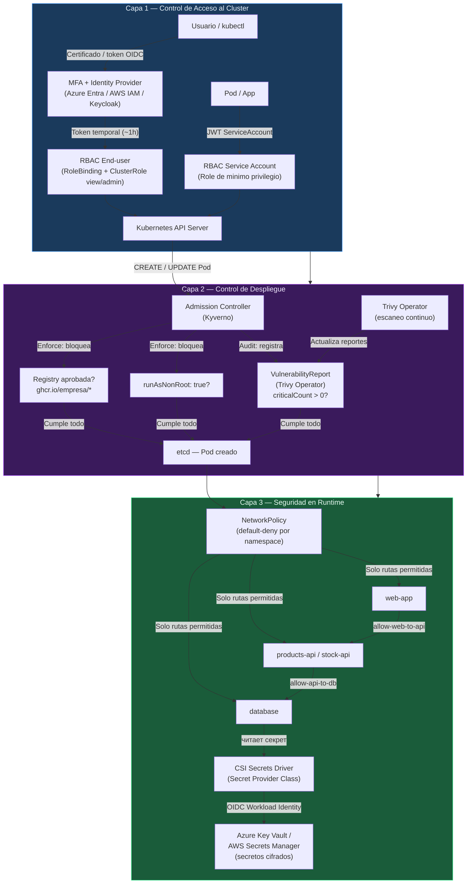
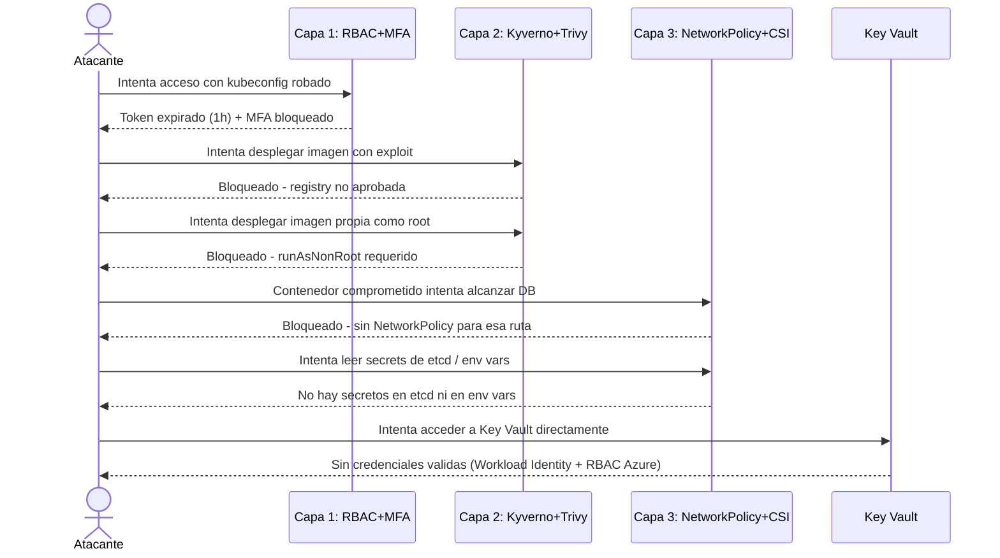

# Seccion 5 - Kubernetes Security (Defense in Depth)

Esta seccion cubre el modelo completo de seguridad en Kubernetes usando tres capas de defensa: control de acceso al cluster, control de lo que se despliega, y seguridad en runtime.

---

## Indice

- [Modulo 1: RBAC y Autenticacion](#modulo-1-rbac-y-autenticacion)
  - [RBAC para Service Accounts](#1-rbac-para-service-accounts)
  - [Autenticacion de Usuarios con MFA](#2-autenticacion-de-usuarios-con-mfa)
- [Modulo 2: Seguridad en Despliegues](#modulo-2-seguridad-en-despliegues)
  - [Escaneo de Imagenes con Trivy Operator](#3-escaneo-de-imagenes-con-trivy-operator)
  - [Politicas de Admision con Kyverno](#4-politicas-de-admision-con-kyverno)
- [Modulo 3: Seguridad en Runtime](#modulo-3-seguridad-en-runtime)
  - [Network Policies como Firewall](#5-network-policies-como-firewall)
  - [Secretos Seguros con CSI Driver](#6-secretos-seguros-con-csi-driver)

---

## Modelo Defense in Depth

Tres capas independientes que se complementan. Si una falla, las otras contienen el daño.



### Flujo de un ataque contenido por las 3 capas



---

## Modulo 1: RBAC y Autenticacion

### 1. RBAC para Service Accounts

Conceptos clave:
- **RBAC (Role-Based Access Control)** controla quien puede acceder a la API de Kubernetes y que operaciones puede realizar
- **Role** define permisos (verbos: get, list, create, delete) sobre recursos (pods, secrets, etc.) dentro de un namespace
- **ClusterRole** igual que Role pero aplica a nivel de cluster o como plantilla reutilizable entre namespaces
- **RoleBinding** conecta un Role a un sujeto (ServiceAccount o User) dentro de un namespace especifico
- **ClusterRoleBinding** conecta un ClusterRole a un sujeto con permisos en todo el cluster
- **Principio de minimo privilegio**: cada pod/app solo debe tener los permisos exactamente necesarios
- **Anti-patron critico**: usar el ServiceAccount `default` con permisos amplios — cualquier pod sin SA explicito lo hereda
- **ServiceAccount tokens** son JWT inyectados en `/var/run/secrets/kubernetes.io/serviceaccount/token` — autentican al pod ante la API
- `automountServiceAccountToken: false` deshabilita el token completamente si la app no necesita acceso a la API
- Los permisos RBAC se evaluan en cada request (no requieren restart del pod)

**Anti-patron: SA default con cluster-admin** (como se ve en el setup inseguro):

```bash
# Verificar si el SA default tiene permisos peligrosos
kubectl get clusterrolebindings -o json | jq -r '.items[] | select(.subjects[]? | select(.name == "default")) | {name: .metadata.name, role: .roleRef.name}'
```

Ejemplo YAML inseguro: [rbac-insecure.yaml](./01/demos/m1/demo1/setup/rbac-insecure.yaml)

```bash
# Desplegar el setup inicial (con configuracion insegura para ver el problema)
kubectl apply -f 01/demos/m1/demo1/setup/

# Ver el SA que usa el pod
kubectl get pod -l app=kube-explorer -o jsonpath='{.items[0].spec.serviceAccountName}'

# Ver namespaces y pods disponibles
kubectl get namespaces
kubectl get pods -n default
kubectl get serviceaccounts -n default
```

**Solucion: SA dedicado con Role de minimo privilegio:**

```bash
# Aplicar RBAC correcto: Role + ServiceAccount + RoleBinding
kubectl apply -f 01/demos/m1/demo1/update-1/

# Verificar que el pod ahora usa el SA correcto
kubectl get pod -l app=kube-explorer -o jsonpath='{.items[0].spec.serviceAccountName}'

# Ver todos los RoleBindings del SA kube-explorer
kubectl get rolebindings -A -o json | jq -r '[.items[] | select(.subjects[].name == "kube-explorer") | {namespace: .metadata.namespace, name: .metadata.name, role: .roleRef.name}]'

# Verificar permisos especificos
kubectl auth can-i get pods --namespace default --as system:serviceaccount:default:kube-explorer
kubectl auth can-i delete pods --namespace default --as system:serviceaccount:default:kube-explorer
kubectl auth can-i get pods --namespace kube-system --as system:serviceaccount:default:kube-explorer
```

Ejemplo YAML: [update-1/rbac.yaml](./01/demos/m1/demo1/update-1/rbac.yaml)

```bash
# Aniadir permisos adicionales (solo lectura en kube-system)
kubectl apply -f 01/demos/m1/demo1/update-2/

# Ver todos los RoleBindings activos del SA
kubectl get rolebindings -A -o json | jq -r '[.items[] | select(.subjects[].name == "kube-explorer") | {namespace: .metadata.namespace, name: .metadata.name, role: .roleRef.name}]'
```

Ejemplo YAML: [update-2/rbac.yaml](./01/demos/m1/demo1/update-2/rbac.yaml)

```bash
# Inspeccionar el token JWT del ServiceAccount
kubectl exec deploy/kube-explorer -- ls -l /var/run/secrets/kubernetes.io/serviceaccount
kubectl exec deploy/kube-explorer -- cat /var/run/secrets/kubernetes.io/serviceaccount/token
# Pegar el token en https://jwt.io para decodificar y ver el subject (identidad del SA)
```

---

### 2. Autenticacion de Usuarios con MFA

Conceptos clave:
- Kubernetes **no gestiona usuarios internamente** — delega autenticacion a sistemas externos (certificados, tokens, OIDC)
- **Autenticacion por certificados** (default): el CA del cluster firma un certificado con el username en CN — NO se puede revocar individualmente y puede ser valido por anios
- **kubeconfig embebe credenciales** (token+certificado): si el archivo es comprometido, el atacante tiene acceso indefinido
- **Integracion con Identity Providers externos** (Azure Entra ID, AWS IAM, Google Identity, Keycloak via OIDC) elimina credenciales estaticas
- **kubelogin** es el adaptador para AKS — maneja el flujo OAuth entre kubectl y Azure Entra
- **MFA** se aplica en el Identity Provider (Azure Entra), no en Kubernetes — incluye acceso condicional, compliance de dispositivo, restricciones de ubicacion
- Tokens de Azure tienen expiracion corta (~1 hora) — limita el impacto de un dispositivo comprometido
- `--disable-local-accounts` en AKS elimina el backdoor de credenciales estaticas embebidas en kubeconfig
- **ClusterRoles predefinidos**: `view` (solo lectura), `edit` (lectura/escritura sin RBAC), `admin` (full namespace), `cluster-admin` (root del cluster)

```bash
# Paso 1: obtener credenciales del cluster (sin AD aun)
az aks get-credentials --resource-group rg-k8s-security-m1 --name aks-k8s-security-m1 --overwrite-existing
kubectl get nodes

# Ver metodo de autenticacion actual (token + certificado estatico)
kubectl config view --minify
```

```bash
# Paso 2: obtener el ID del grupo de admins en Entra ID
az ad group list -o table
$adminGroupId = az ad group show --group "cluster-admins" --query id -o tsv

# Habilitar Azure Entra ID y deshabilitar cuentas locales
az aks update `
    --resource-group rg-k8s-security-m1 `
    --name aks-k8s-security-m1 `
    --enable-aad `
    --aad-admin-group-object-ids $adminGroupId `
    --disable-local-accounts
```

```bash
# Paso 3: instalar kubelogin (adaptador OAuth para kubectl)
curl -sSL -o kubelogin.zip https://github.com/Azure/kubelogin/releases/download/v0.2.12/kubelogin-darwin-arm64.zip
sudo unzip -j kubelogin.zip -d /usr/local/bin
chmod +x /usr/local/bin/kubelogin

# Obtener credenciales (ahora kubeconfig usa exec con kubelogin)
az aks get-credentials --resource-group rg-k8s-security-m1 --name aks-k8s-security-m1 --overwrite-existing
kubectl config view --minify  # ahora muestra "exec" en vez de token estatico
```

```bash
# Paso 4: autenticacion real con MFA
kubectl get nodes
# Imprime device code + URL -> autenticacion en navegador con MFA

# Verificar permisos del admin
kubectl auth can-i get pods --all-namespaces
kubectl auth can-i create clusterroles
kubectl auth can-i --list
```

```bash
# Paso 5: crear usuario con minimo privilegio (solo view en namespace wiredbrain)
kubectl apply -f 01/demos/m1/demo2/rbac/least-privilege.yaml

# Obtener credenciales para usuario diferente (kubeconfig separado)
az aks get-credentials --resource-group rg-k8s-security-m1 --name aks-k8s-security-m1 --file least-privilege.kubeconfig

# Probar acceso con usuario restringido (tambien pasa por MFA)
kubectl --kubeconfig least-privilege.kubeconfig get nodes        # Forbidden
kubectl --kubeconfig least-privilege.kubeconfig get pods -n wiredbrain  # OK
kubectl --kubeconfig least-privilege.kubeconfig auth can-i --list
```

Ejemplo YAML: [least-privilege.yaml](./01/demos/m1/demo2/rbac/least-privilege.yaml)

---

## Modulo 2: Seguridad en Despliegues

### 3. Escaneo de Imagenes con Trivy Operator

Conceptos clave:
- **Supply chain complexity**: cada imagen de contenedor es una cadena de suministro completa (OS base, runtime, framework, dependencias) con cientos de paquetes en release schedules independientes
- **CVE (Common Vulnerabilities and Exposures)**: vulnerabilidades conocidas catalogadas con severidad (Critical, High, Medium, Low)
- **Trivy Operator** es un componente CNCF que escanea continuamente todas las imagenes de los pods en el cluster
- Produce **VulnerabilityReport** como custom resource de Kubernetes — consultable con kubectl
- El escaneo es continuo: la base de datos de CVEs se actualiza regularmente — detecta nuevas vulnerabilidades en imagenes ya desplegadas
- Imagenes desconocidas (sin pods corriendo) no se escanean — Trivy las descubre a traves de los pods activos
- Los reportes persisten aunque el pod se elimine (se limpian si se elimina el Deployment completo)

```bash
# Instalar Trivy Operator via Helm
helm repo add aqua https://aquasecurity.github.io/helm-charts/
helm repo update

helm install trivy-operator aqua/trivy-operator \
  --namespace trivy-system --create-namespace \
  --set="trivy.resources.limits.memory=4Gi" \
  --version 0.31.0 --wait

# Desplegar app vulnerable para ver el escaneo en accion
kubectl apply -f 02/demos/m2/demo1/initial-scan/
```

Ejemplo YAML: [vulnerable-app.yaml](./02/demos/m2/demo1/initial-scan/vulnerable-app.yaml)

```bash
# Observar la creacion del VulnerabilityReport (tarda unos minutos)
kubectl get vulnerabilityreport -w -n wiredbrain

# Ver resumen del reporte
kubectl get vulnerabilityreport -n wiredbrain -o yaml | grep -A 10 summary

# Ver conteo de CVEs por severidad
kubectl get vulnerabilityreport -n wiredbrain -o jsonpath='{.items[0].report.summary}'

# Listar todos los reportes en el cluster
kubectl get vulnerabilityreport -A

# Escalar a 0 para quitar el pod vulnerable (el reporte persiste)
kubectl scale deploy/products-api-vulnerable --replicas 0 -n wiredbrain
```

```bash
# Aplicar politica que bloquea imagenes con CVEs criticos
kubectl apply -f 02/demos/m2/demo1/admission-control/block-critical-cves.yaml
```

Ejemplo YAML: [block-critical-cves.yaml](./02/demos/m2/demo1/admission-control/block-critical-cves.yaml)

```bash
# Intentar redesplegar la imagen vulnerable (sera bloqueada por Kyverno)
kubectl apply -f 02/demos/m2/demo1/initial-scan/vulnerable-app.yaml
# Error: Image contains X CRITICAL severity CVEs and is blocked by security policy

# Desplegar imagen parcheada (nueva imagen sin CVEs criticos)
kubectl apply -f 02/demos/m2/demo1/update-1/
# Esperar reporte de Trivy con 0 CVEs criticos
kubectl get vulnerabilityreport -n wiredbrain -w
```

---

### 4. Politicas de Admision con Kyverno

Conceptos clave:
- **Kyverno** es un policy engine nativo de Kubernetes — las politicas se definen como YAML (ClusterPolicy)
- **Admission Control**: intercepta creaciones/actualizaciones de recursos antes de que se persistan en etcd
- `validationFailureAction: Enforce` — bloquea el recurso si viola la politica (hard gate)
- `validationFailureAction: Audit` — permite el recurso pero registra la violacion (soft gate, para visibilidad)
- **Policy Reports**: Kyverno genera reportes automaticos de evaluacion de politicas consultables con kubectl
- Politicas de enforcement recomendadas: registry aprobada, runAsNonRoot, no privileged containers
- Politicas de audit recomendadas: CVEs criticos (para no bloquear auto-scaling durante un incidente)
- Las politicas tienen mensajes de error claros — informan al desarrollador exactamente que hay que corregir

```bash
# Instalar Kyverno via Helm
helm repo add kyverno https://kyverno.github.io/kyverno/
helm repo update

helm install kyverno kyverno/kyverno \
  --namespace kyverno --create-namespace \
  --version 3.5.2 --wait

# Ver pods de Kyverno (admission-controller, background-controller, cleanup-controller)
kubectl get pods -n kyverno
```

```bash
# Aplicar politicas de seguridad (Enforce: registry + non-root)
kubectl apply -f 02/demos/m2/demo2/admission-control/security-policies.yaml

# Aplicar politica de CVEs (Audit: no bloquea pero registra)
kubectl apply -f 02/demos/m2/demo2/admission-control/vulnerability-report-policy.yaml
```

Ejemplo YAML: [security-policies.yaml](./02/demos/m2/demo2/admission-control/security-policies.yaml)
Ejemplo YAML: [vulnerability-report-policy.yaml](./02/demos/m2/demo2/admission-control/vulnerability-report-policy.yaml)

```bash
# Test 1: imagen de registry no aprobada (docker.io) -> bloqueada
kubectl apply -f 02/demos/m2/demo2/test-deployments/01-wrong-registry.yaml
# Error: Images must be pulled from the approved registry: ghcr.io/wiredbrain/

# Test 2: imagen correcta pero corre como root -> bloqueada
kubectl apply -f 02/demos/m2/demo2/test-deployments/02-runs-as-root.yaml
# Error: Containers must run as non-root user for security

# Test 3: imagen correcta + non-root PERO con CVEs criticos -> pasa enforce, auditado
kubectl apply -f 02/demos/m2/demo2/test-deployments/03-has-critical-cves.yaml
# Deployment creado, pero Kyverno registra violacion

# Test 4: deployment completamente correcto -> pasa todo
kubectl apply -f 02/demos/m2/demo2/test-deployments/04-compliant.yaml
```

```bash
# Ver Policy Reports generados por Kyverno
kubectl get policyreport -A
kubectl get policyreport -n wiredbrain -o yaml

# Ver violaciones registradas (modo audit)
kubectl get policyreport -n wiredbrain -o jsonpath='{.items[0].results}' | jq .

# Ver todos los VulnerabilityReports del cluster
kubectl get vulnerabilityreport -A
```

---

## Modulo 3: Seguridad en Runtime

### 5. Network Policies como Firewall

Conceptos clave:
- **Kubernetes networking es abierto por default**: cualquier pod puede comunicarse con cualquier otro pod en cualquier namespace
- **NetworkPolicy** es el firewall nativo de Kubernetes — define reglas de trafico usando selectores de labels
- `Ingress`: trafico entrante al pod (quien puede enviarme trafico)
- `Egress`: trafico saliente del pod (a donde puedo mandar trafico)
- **Zero-trust baseline**: aplicar `default-deny` con `podSelector: {}` (todos los pods) sin reglas — bloquea todo
- Las politicas son **aditivas**: multiples NetworkPolicies para el mismo pod se acumulan (OR logico)
- **DNS es infraestructura critica**: bloquear todo egress tambien bloquea DNS (puerto 53/UDP kube-system) — debe permitirse explicitamente
- NetworkPolicy requiere un **CNI plugin compatible** (Flannel NO soporta NetworkPolicy; Calico, Cilium, k3d si)
- Las reglas se evaluan en **runtime sin restart** de pods
- Una NetworkPolicy necesita reglas en **ambas direcciones**: egress en origen + ingress en destino

```bash
# Prerrequisito: cluster con soporte de NetworkPolicy (k3d recomendado para local)
k3d cluster create networkpolicy-demo \
    --agents 1 \
    --k3s-arg "--disable=traefik@server:0" \
    --port "8001:8001@loadbalancer"

# Desplegar la app sin restricciones de red
kubectl apply -f 03/demos/m3/demo1/initial-deploy/

# Verificar pods corriendo
kubectl get pods -n wiredbrain

# Probar problema: web puede llegar a DB directamente (sin pasar por API)
kubectl exec -n wiredbrain deploy/web-app -- nc -zv products-db 5432
# Conexion exitosa -> vulnerabilidad
```

```bash
# Aplicar baseline zero-trust: bloquear todo trafico
kubectl apply -f 03/demos/m3/demo1/default-deny/default-deny.yaml

# Verificar que todo esta bloqueado
kubectl exec -n wiredbrain deploy/web-app -- nc -zv products-db 5432
# Falla -> bloqueado
kubectl exec -n wiredbrain deploy/web-app -- wget -qO- http://products-api
# Falla incluso DNS -> bloqueado
```

Ejemplo YAML: [default-deny.yaml](./03/demos/m3/demo1/default-deny/default-deny.yaml)

```bash
# Paso 1 (critico): permitir DNS para todos los pods
kubectl apply -f 03/demos/m3/demo1/allow-policies/allow-dns.yaml
# Ahora los pods pueden resolver nombres de servicios
```

Ejemplo YAML: [allow-dns.yaml](./03/demos/m3/demo1/allow-policies/allow-dns.yaml)

```bash
# Paso 2: permitir trafico especifico de la aplicacion
# Egress de los APIs hacia la DB
kubectl apply -f 03/demos/m3/demo1/allow-policies/app/allow-api-egress.yaml

# Ingress a la DB desde los APIs
kubectl apply -f 03/demos/m3/demo1/allow-policies/app/allow-api-to-db.yaml

# Egress de web hacia los APIs
kubectl apply -f 03/demos/m3/demo1/allow-policies/app/allow-web-egress.yaml

# Ingress a los APIs desde web
kubectl apply -f 03/demos/m3/demo1/allow-policies/app/allow-web-to-api.yaml

# O aplicar todas juntas
kubectl apply -f 03/demos/m3/demo1/allow-policies/
```

Ejemplos YAML:
- [allow-api-egress.yaml](./03/demos/m3/demo1/allow-policies/app/allow-api-egress.yaml)
- [allow-api-to-db.yaml](./03/demos/m3/demo1/allow-policies/app/allow-api-to-db.yaml)
- [allow-web-egress.yaml](./03/demos/m3/demo1/allow-policies/app/allow-web-egress.yaml)
- [allow-web-to-api.yaml](./03/demos/m3/demo1/allow-policies/app/allow-web-to-api.yaml)

```bash
# Verificar que la segmentacion funciona correctamente:

# Debe FALLAR: web -> database (bypass de API)
kubectl exec -n wiredbrain deploy/web-app -- nc -zv products-db 5432

# Debe FUNCIONAR: web -> products-api
kubectl exec -n wiredbrain deploy/web-app -- wget -qO- http://products-api/products

# Debe FALLAR: cualquier pod -> internet
kubectl exec -n wiredbrain deploy/web-app -- wget -qO- http://example.com
```

---

### 6. Secretos Seguros con CSI Driver

Conceptos clave:
- **Kubernetes Secrets** usan codificacion base64 — NO es cifrado, cualquiera con acceso al recurso puede decodificar
- `kubectl get secret <name> -o jsonpath='{.data.password}' | base64 -d` — decodifica inmediatamente
- **Tres vectores de ataque** de Kubernetes Secrets: en source control (values.yaml), en etcd (base64), en variables de entorno del pod (printenv)
- **etcd puede cifrar secrets en reposo**, pero requiere configuracion adicional que frecuentemente se omite
- **External Secrets Management**: AWS Secrets Manager, Azure Key Vault, HashiCorp Vault — los secretos nunca tocan etcd
- **Secret Store CSI Driver** es el adaptador que monta secretos externos como archivos en el pod
- **SecretProviderClass** es el custom resource que define que secretos obtener de que vault
- **Workload Identity / IRSA**: el pod se autentica al vault usando su ServiceAccount + OIDC — sin credenciales estaticas
- Los secretos se montan como archivos en `/mnt/secrets/` — almacenados en memoria del nodo, NO persistidos en disco
- El ultimo vector de ataque que persiste: `kubectl exec` al pod permite leer los archivos — mitigar con RBAC que prohiba exec

```bash
# Ver el problema con Kubernetes Secrets normales
kubectl get secret db-credentials -n wiredbrain -o yaml
# El campo .data.password es base64

# Decodificar (trivial)
kubectl get secret db-credentials -n wiredbrain -o jsonpath='{.data.password}' | base64 -d

# Ver el secret en el pod (otro vector de ataque)
kubectl exec -n wiredbrain deploy/database -- printenv POSTGRES_PASSWORD
```

```bash
# Desplegar la app usando CSI Driver con Azure Key Vault
# Prerrequisito: AKS con workload identity habilitado, Key Vault creado
# Ver setup.ps1 para crear toda la infraestructura Azure

helm install wiredbrain ./03/demos/m3/demo2/charts/wiredbrain-secure \
    --namespace wiredbrain --create-namespace \
    -f ./03/demos/m3/demo2/charts/wiredbrain-secure/values-csi.yaml \
    --wait
```

Ejemplo YAML: [secret-provider.yaml](./03/demos/m3/demo2/charts/wiredbrain-secure/templates/secret-provider.yaml)
Ejemplo YAML: [serviceaccount.yaml](./03/demos/m3/demo2/charts/wiredbrain-secure/templates/serviceaccount.yaml)
Ejemplo YAML: [database.yaml (CSI volume)](./03/demos/m3/demo2/charts/wiredbrain-secure/templates/database.yaml)

```bash
# Verificar que el Kubernetes Secret ya no existe
kubectl get secret db-credentials -n wiredbrain
# Error: not found

# El pod ya no tiene el secret como variable de entorno
kubectl exec -n wiredbrain deploy/database -- printenv POSTGRES_PASSWORD
# (vacio)

# El password esta montado como archivo (en memoria, no en disco)
kubectl exec -n wiredbrain deploy/database -- ls /mnt/secrets/
kubectl exec -n wiredbrain deploy/database -- cat /mnt/secrets/postgres-password
```

```bash
# Comandos de Azure Key Vault para verificar secretos
az keyvault secret list --vault-name <vault-name> -o table
az keyvault secret show --vault-name <vault-name> --name postgres-password --query value -o tsv
# Los secretos en Key Vault estan cifrados, auditados, con control de acceso Azure RBAC
```

---

## Referencia rapida: kubectl auth can-i

```bash
# Verificar permisos de un SA especifico
kubectl auth can-i get pods --namespace default --as system:serviceaccount:default:kube-explorer
kubectl auth can-i delete pods --namespace kube-system --as system:serviceaccount:default:kube-explorer

# Listar todos los permisos del usuario actual
kubectl auth can-i --list
kubectl auth can-i --list --namespace wiredbrain

# Verificar permisos de otro usuario (impersonacion)
kubectl auth can-i get pods --as user@example.com -n wiredbrain
```

## Referencia rapida: consultas de seguridad

```bash
# Ver todos los ClusterRoleBindings del SA default (detectar cluster-admin incorrecto)
kubectl get clusterrolebindings -o json | jq -r '.items[] | select(.subjects[]? | select(.name == "default")) | {name: .metadata.name, role: .roleRef.name}'

# Ver todos los RoleBindings de un SA en todos los namespaces
kubectl get rolebindings -A -o json | jq -r '[.items[] | select(.subjects[].name == "kube-explorer") | {namespace: .metadata.namespace, name: .metadata.name, role: .roleRef.name}]'

# Ver todos los VulnerabilityReports del cluster
kubectl get vulnerabilityreport -A

# Ver Policy Reports de Kyverno
kubectl get policyreport -A

# Ver NetworkPolicies activas en un namespace
kubectl get networkpolicy -n wiredbrain

# Describir una NetworkPolicy (ver reglas detalladas)
kubectl describe networkpolicy default-deny-all -n wiredbrain
```
